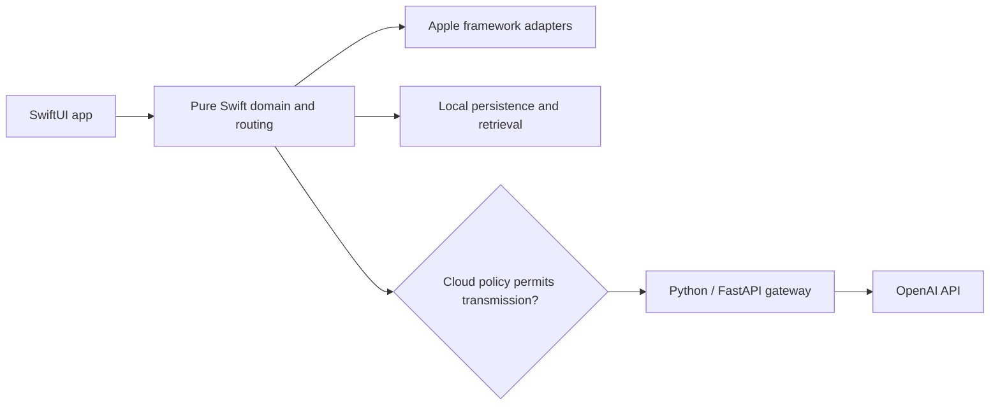

# ContextLens

A planned privacy-first, native iPhone application that turns text, images, and documents into structured explanations, extracted information, and searchable local knowledge.

**Status:** foundation in progress. The backend has a tested health endpoint and secret-safe settings. No iOS application features or Apple builds have been validated yet.

The intended experience combines on-device extraction, explicit cloud-processing consent, typed AI results, and offline library search. The iOS app will never contain an OpenAI API key.

## Architecture



See [architecture](docs/architecture.md) and the [release roadmap](docs/roadmap.md) for planned boundaries and validation requirements.

## Development and validation

Development takes place on Windows. GitHub Actions macOS runners will generate the Xcode project, build for iOS Simulator, execute XCTest/XCUITest, and upload test results and screenshots. No local Mac or manual Xcode step is required. Apple workflows are pending; security CI scans secrets and repository hygiene, and backend CI runs lint, types, isolated tests, and a runtime dependency audit.

The planned layout is `ContextLensApp/` for the native client, `ContextLensCore/` for the pure Swift package, `backend/` for the gateway, and `Fixtures/` for synthetic test inputs. Source directories will be introduced with their implementation units.

## Backend configuration

Install Python 3.11 and [uv](https://docs.astral.sh/uv/getting-started/installation/), then run from `backend/`:

```powershell
uv sync --frozen
# On first setup only, copy .env.example to .env if .env does not already exist.
uv run uvicorn app.main:create_app --factory --host 127.0.0.1 --port 8000
```

`GET /health` reports liveness, not upstream model readiness. The scaffold does not call OpenAI or expose analysis routes. It is not a publicly deployed gateway.

The backend reads `OPENAI_API_KEY`, `OPENAI_MODEL`, and `APP_ENV`. Keep real credentials in ignored `backend/.env`; never place them in app resources or client build settings. Blank or missing `OPENAI_MODEL` selects `gpt-5.4-mini-2026-03-17`; see [model selection](docs/model-selection.md). Environment variables override the local file. Tests inject settings and never read the developer's file.

```powershell
uv run ruff check .
uv run ruff format --check .
uv run mypy
uv run python -m pytest
```

Normal CI will use deterministic mocks and require no live API key. Cloud requests will require an explicit processing policy; local-only mode must never transmit content.

## Releases

No release has been published. Milestones will be published in [GitHub Releases](https://github.com/la3679/contextlens-ios/releases) only after their required checks pass. License selection and the remaining contributor documentation are pending foundation work.
