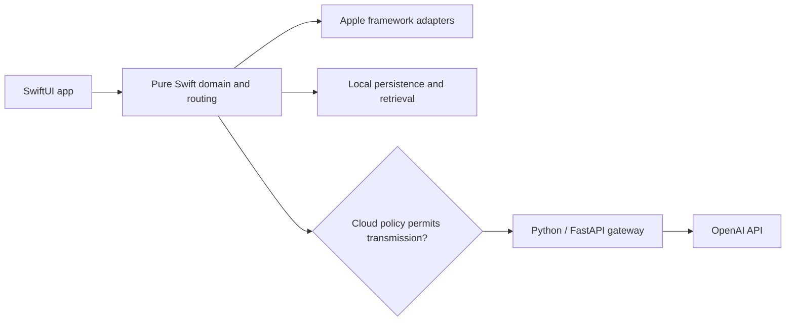

# ContextLens

A planned privacy-first, native iPhone application that turns text, images, and documents into structured explanations, extracted information, and searchable local knowledge.

**Status:** repository foundation only. No application features or Apple builds have been validated yet.

The intended experience combines on-device extraction, explicit cloud-processing consent, typed AI results, and offline library search. The iOS app will never contain an OpenAI API key.

## Architecture

See [architecture](docs/architecture.md) and the [release roadmap](docs/roadmap.md) for planned boundaries and validation requirements.

## Development and validation

Development takes place on Windows. GitHub Actions macOS runners will generate the Xcode project, build for iOS Simulator, execute XCTest/XCUITest, and upload test results and screenshots. No local Mac or manual Xcode step is required. These workflows are not implemented yet.

The planned layout is `ContextLensApp/` for the native client, `ContextLensCore/` for the pure Swift package, `backend/` for the gateway, and `Fixtures/` for synthetic test inputs. Source directories will be introduced with their implementation units.

## Backend configuration

The backend will read `OPENAI_API_KEY`, `OPENAI_MODEL`, and `APP_ENV` from its environment. Keep real values in the ignored `backend/.env`; use `backend/.env.example` as the safe configuration template when available. Never place provider credentials in app resources or client build settings. Backend installation and startup instructions will accompany the tested scaffold.

Normal CI will use deterministic mocks and require no live API key. Cloud requests will require an explicit processing policy; local-only mode must never transmit content.

## Releases

No release has been published. Milestones will be published in [GitHub Releases](https://github.com/la3679/contextlens-ios/releases) only after their required checks pass. License selection and the remaining contributor documentation are pending foundation work.
